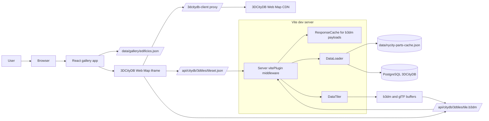
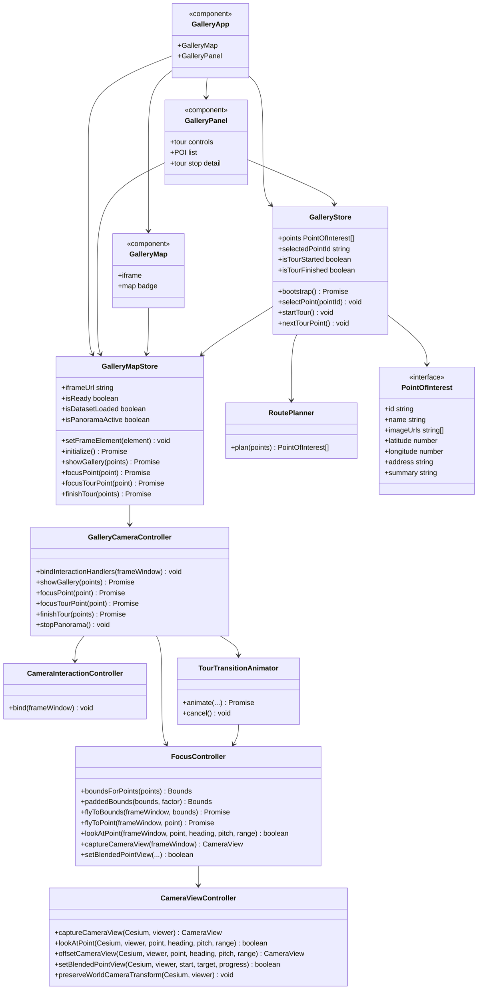
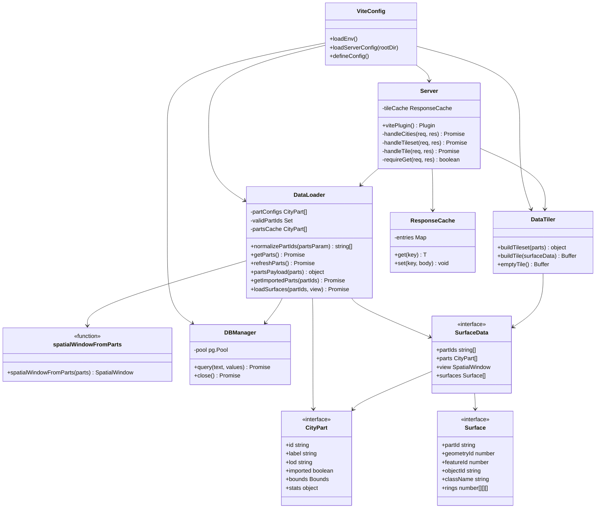
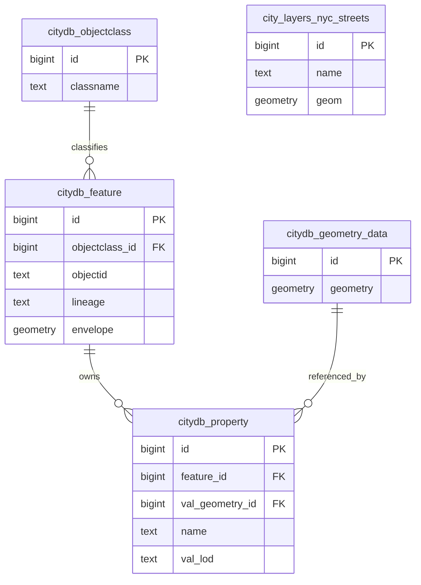
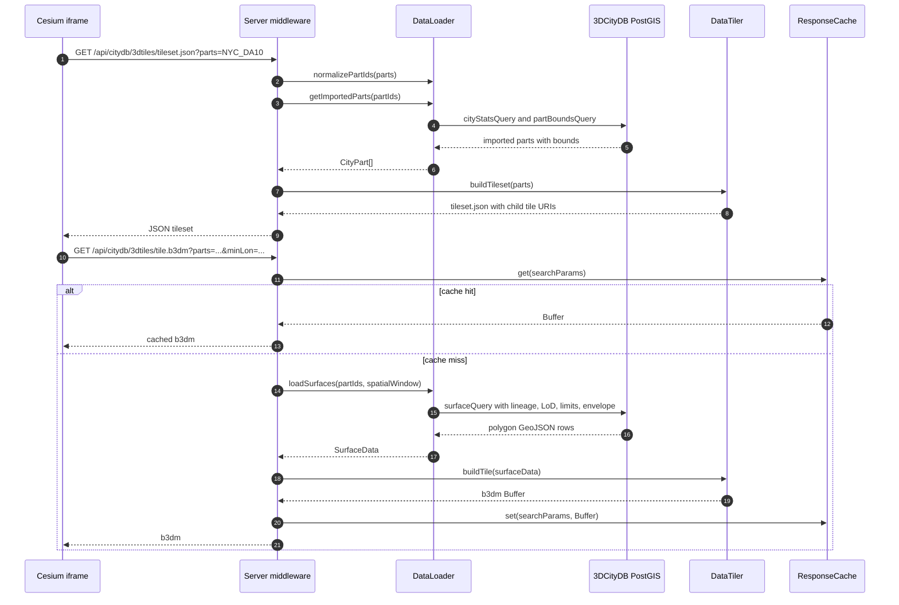
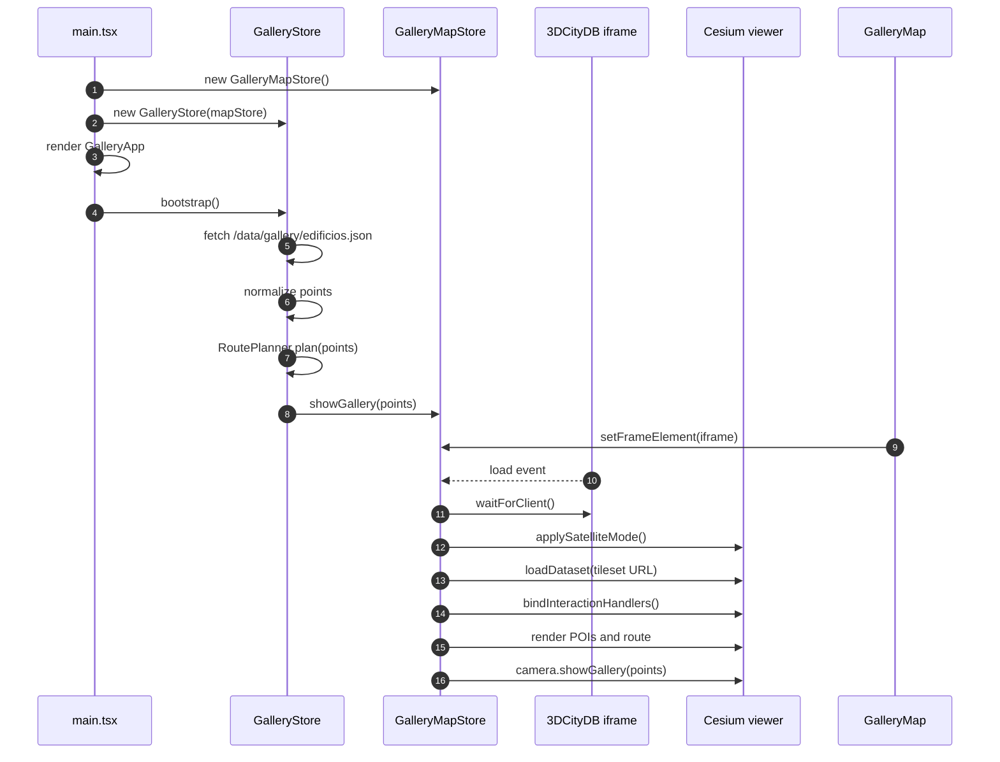
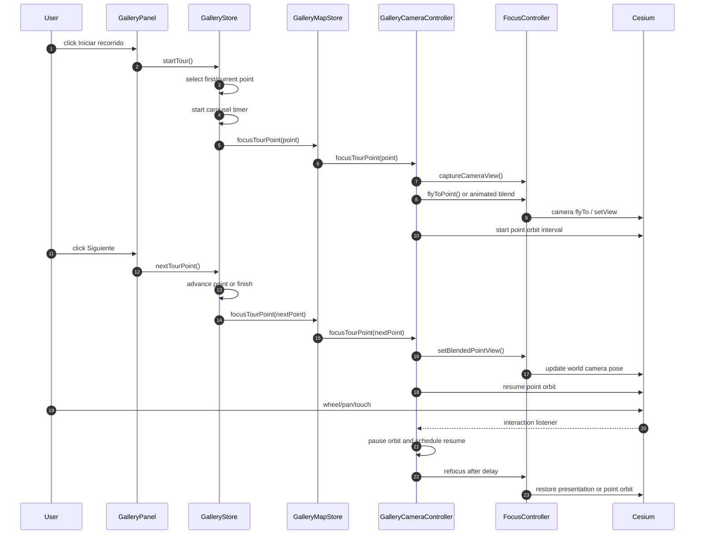
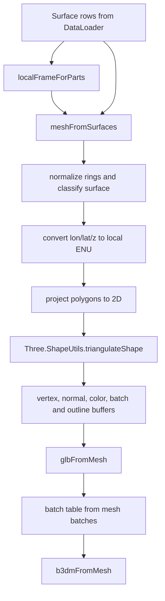

# Architecture diagrams

This document summarizes the most important runtime relationships in the
CityGML LoD viewer. The diagrams are written in Mermaid so they can be rendered
directly by GitHub, VS Code extensions, or Mermaid CLI.

## System communication

The browser hosts two UI layers: the local React/MobX gallery and the proxied
3DCityDB Web Map client inside an iframe. The iframe loads Cesium 3D Tiles from
the local Vite middleware, while gallery points are loaded from static JSON and
rendered into the embedded Cesium viewer by `GalleryMapStore`.

## Client classes

Relevant source files:

- `src/client/main.tsx`
- `src/client/app/GalleryApp.tsx`
- `src/client/app/GalleryMap.tsx`
- `src/client/app/GalleryPanel.tsx`
- `src/client/stores/GalleryStore.ts`
- `src/client/stores/GalleryMapStore.ts`
- `src/client/stores/GalleryCameraController.ts`
- `src/client/stores/CameraInteractionController.ts`
- `src/client/stores/TourTransitionAnimator.ts`
- `src/client/focus/FocusController.ts`
- `src/client/focus/CameraViewController.ts`
- `src/client/routing/RoutePlanner.ts`

## Server classes

The server is a Vite plugin, not a separate process. It registers middleware for
`/api/citydb/*` and `/3dcitydb-client/*`, then delegates database access to
`DataLoader` and binary tile creation to `DataTiler`.

## Database model used by the app

The current dynamic 3D Tiles path queries `citydb.feature`,
`citydb.property`, `citydb.geometry_data`, and `citydb.objectclass`.
`feature.lineage` partitions imported delivery areas such as `NYC_DA10`.
`feature.envelope` provides part bounds and `geometry_data.geometry` provides
renderable polygons filtered by the requested tile window. The README also
documents `city_layers.nyc_streets`, but the current `Server.ts` routes do not
register the streets endpoint.

## Tileset and tile request sequence

## App bootstrap sequence

`GalleryStore.bootstrap()` and `GalleryMapStore.initialize()` can overlap. Both
paths call `waitForClient()`, so rendering gallery entities is delayed until the
iframe exposes `Cesium.Cesium3DTileset` and `cesiumViewer`.

## Guided tour sequence

<!-- ## Tile generation pipeline -->

The generated `b3dm` contains a glTF mesh with triangle and line primitives.
Batch table metadata preserves `partId`, `geometryId`, `featureId`, `objectId`,
`className`, `lod`, `property`, and derived `surfaceType` for Cesium styling or
inspection.
